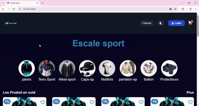

# Escale Sport Admin Dashboard

Escale Sport Admin Dashboard is a Django-based application designed to manage categories and products for an e-commerce platform. It provides functionalities to manage product images, sizes, quantities, prices, and sales duration.

## Features

- Manage product categories with multilingual support (French and Arabic).
- Add and manage products with multiple images.
- Track product quantities, prices, and sales.
- Automatically calculate the end date of sales based on the number of days specified.

## Installation

1. Clone the repository:
   ```bash
   git clone git@github.com:m-elhamlaoui/EscaleSport.git
   ```

2. Navigate to the project directory:
   ```bash
   cd EscaleSport
   ```

3. Install dependencies:
   ```bash
   pip install -r requirements.txt
   ```

4. Apply migrations:
   ```bash
   python manage.py migrate
   ```

5. Run the development server:
   ```bash
   python manage.py runserver
   ```

## Usage

1. Access the admin dashboard by navigating to `/admin` in your browser.
2. Add categories and products using the admin interface.
3. Manage product details, including images, size, quantity, price, and sales duration.

## Models

### Category
- `image`: Image of the category.
- `nameFr`: Name of the category in French.
- `nameAr`: Name of the category in Arabic.

### Products
- `image1`, `image2`, `image3`, `image4`: Images of the product.
- `size`: Size of the product.
- `quantity`: Quantity available.
- `price`: Price of the product.
- `sold`: Number of items sold.
- `days`: Duration of the sale in days.
- `startedAt`: Start date of the sale.
- `category`: Foreign key linking the product to a category.
- `sale_end`: Property to calculate the end date of the sale.

## 🎥 Demo en Video  

<p align="center" >
  
  <br>
  <br>
</p>
